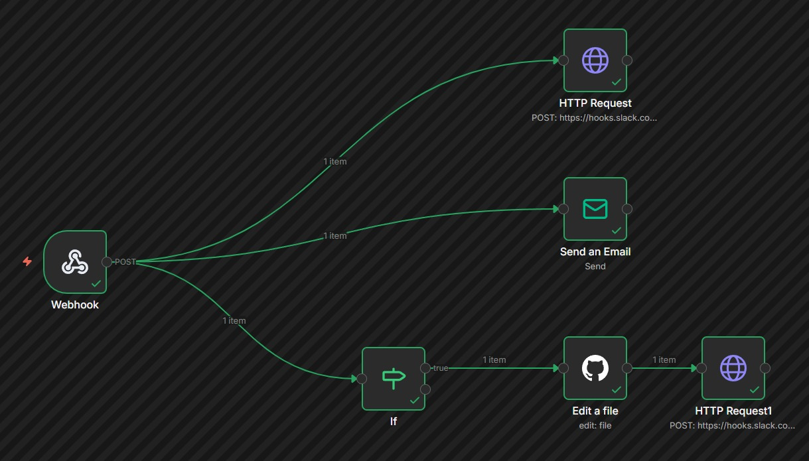
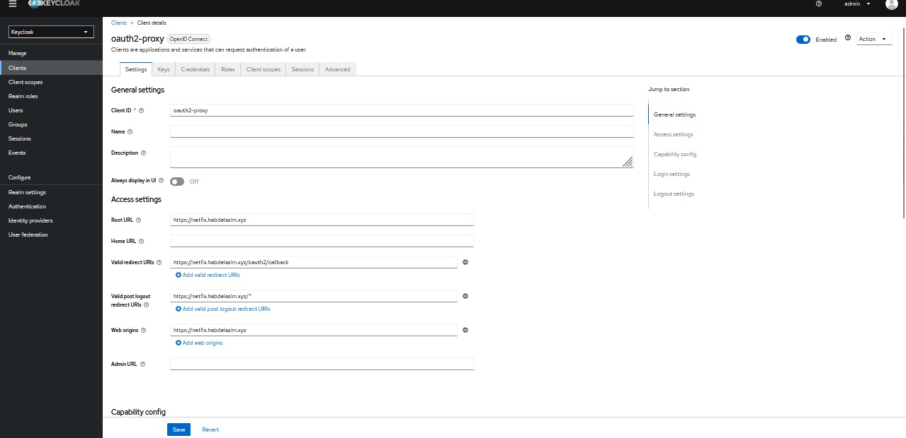
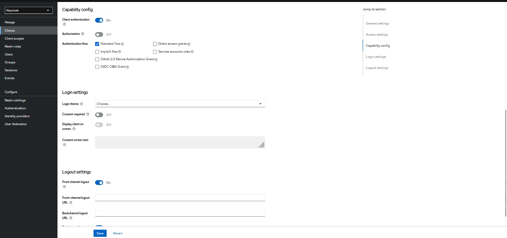
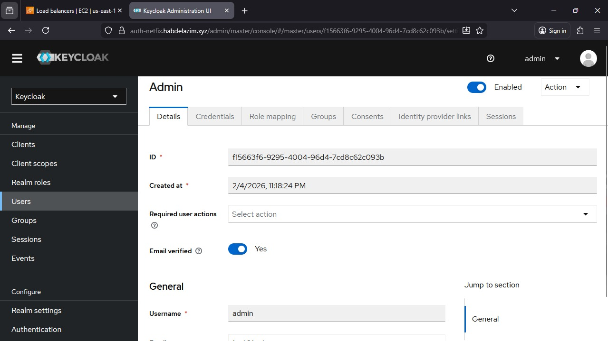
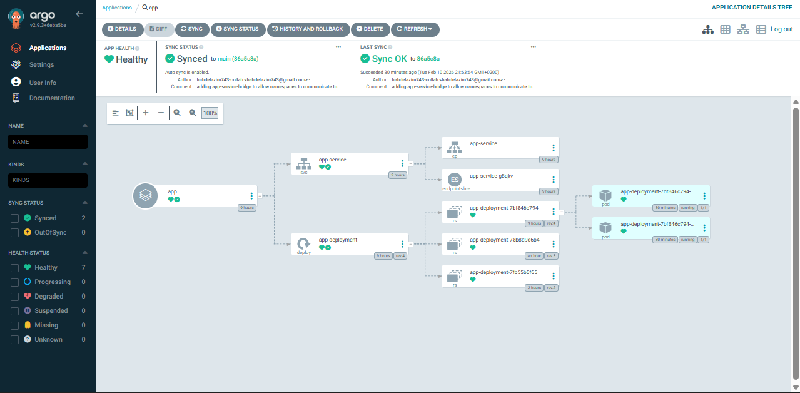
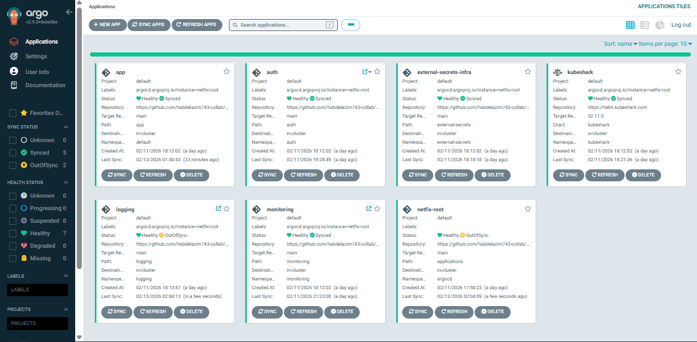
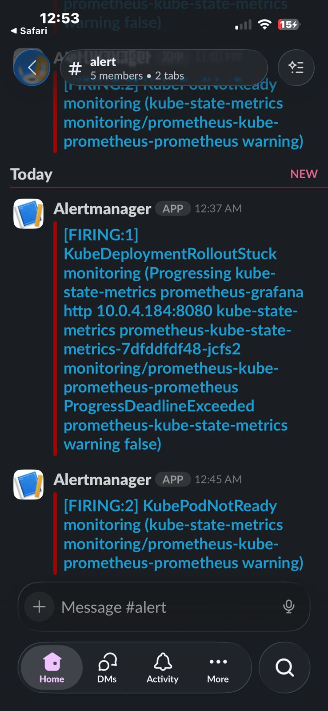
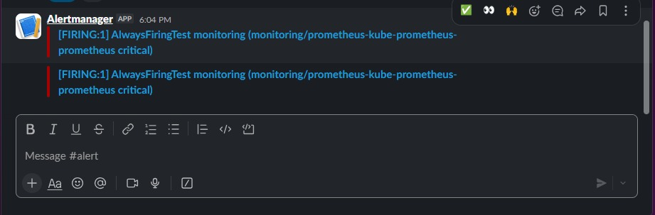
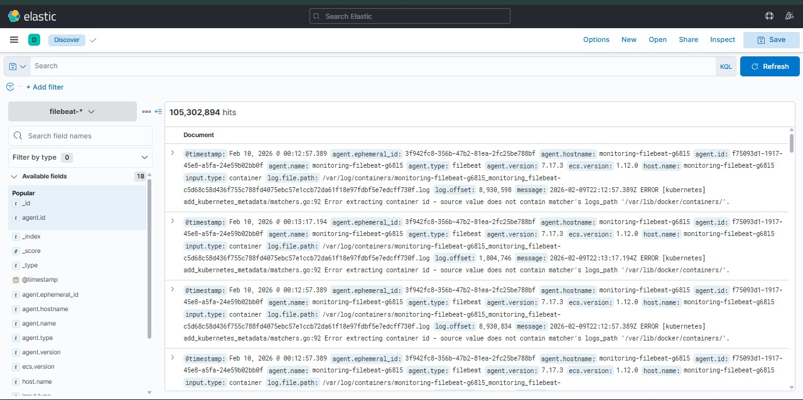

# 🎬 Netflix Clone -- End-to-End DevOps & Cloud Platform

## 📌 Introduction

This project is a complete end-to-end We implemented... of a Netflix-like
streaming platform built using modern Cloud and DevOps technologies.

The purpose of this project was not only to build a working application,
but to understand how real production systems are designed, deployed,
secured, monitored, and maintained in professional environments.

Throughout this project, every stage was implemented manually, tested,
debugged, and improved through real problems and troubleshooting.

This documentation combines all stages and experiences into one detailed
guide so that anyone can understand how this system was built and how it
can be recreated.

We used the domain:

https://netfix.habdelazim.xyz

instead of "Netflix" to avoid trademark conflicts and legal issues.


------------------------------------------------------------------------

## 📦 Source Code Repositories

The project is split into multiple repositories to follow real-world
separation of concerns and GitOps best practices.

- **Application (CI & Docker)**
  https://github.com/mahmoudtots/Netflix-Clone-CI

- **Infrastructure (Terraform & GitHub Actions)**
  https://github.com/habdelazim743-collab/infrastructure-for-Netflix-Clone-K8S-End-to-End-Project

- **GitOps / ArgoCD (Kubernetes Manifests)**
  https://github.com/habdelazim743-collab/complete_k8s_config_for_netfix_app.git

------------------------------------------------------------------------

## 🎯 Project Goals

The main goals of this project were:

-   Learn real cloud architecture design
-   Apply Infrastructure as Code
-   Build complete CI/CD pipelines
-   Deploy applications using Kubernetes
-   Implement authentication systems
-   Apply GitOps practices
-   Integrate monitoring and logging
-   Follow security best practices
-   Build a strong professional portfolio

This project was developed as if it were running in a real company
environment.

------------------------------------------------------------------------

## 🧠 Technical Decisions

### Why EKS Instead of Self-Managed Kubernetes

Managing Kubernetes manually requires handling control plane updates,
security patches, and availability.

EKS was chosen to reduce operational overhead and focus more on application
and DevOps workflows.

### Why Keycloak Instead of Custom Authentication

Building authentication from scratch is risky and error-prone.

Keycloak provides enterprise-grade security, standard protocols (OAuth2, OIDC),
and built-in features such as session management and token handling.

### Why Jenkins Instead of GitHub Actions Only

Jenkins provides more flexibility for complex pipelines, plugins,
and integration with external systems like n8n.

GitHub Actions was mainly used for infrastructure automation.





### Why ELK Instead of CloudWatch

ELK provides advanced log searching, filtering, and visualization
across multiple services and namespaces.

CloudWatch alone is limited for deep log analysis.

------------------------------------------------------------------------

## 🏗️ Overall System Architecture

The system is built using multiple layers:

1.  User Layer (Web Browser)
2.  Frontend Layer (React Application)
3.  Authentication Layer (Keycloak)
4.  Container Layer (Docker)
5.  Orchestration Layer (Kubernetes / EKS)
6.  Infrastructure Layer (AWS)
7.  Monitoring and Logging Layer

Each layer has a specific responsibility and helps keep the system
stable, secure, and scalable.

The platform is designed for high availability across two availability zones

During testing, the platform maintained more than 99% availability.


### 📐 DevOps & Platform Architecture Blueprints

The following diagrams illustrate the overall DevOps workflow,
business impact, and production architecture of the platform.


------------------------------------------------------------------------

## 📂 EKS Cluster Structure

The Kubernetes cluster is organized using namespaces to separate
responsibilities:

    EKS Cluster
    │
    ├── Namespace: application
    │   ├── frontend-pods
    │   ├── frontend-service
    │   └── ingress
    │
    ├── Namespace: auth
    │   ├── keycloak-pods
    │   ├── keycloak-service
    │   └── oauth
    │
    ├── Namespace: monitoring
    │   ├── prometheus
    │   ├── grafana
    │   └── alertmanager
    │
    └── Namespace: logging
        ├── elasticsearch
        ├── filebeat
        └── kibana


This separation improves security, management, and scalability.

------------------------------------------------------------------------

## 🚀 Stage 1: Frontend Development

### We implemented...

We started by building the frontend application using:

-   React
-   TypeScript
-   Vite

We connected the application to the TMDB API to retrieve movie data.


### Why This Approach Was Chosen:

React allows building reusable components. TypeScript reduces runtime
errors. Vite improves build speed.

Using TMDB API allows the application to display real movie content.

### Problems Faced

At the beginning, the application interface loaded correctly, but no
data was shown.

### Root Cause

The TMDB API key was missing and environment variables were not
configured correctly.

### How We Fixed It

1.  Created a TMDB API key
2.  Added it to a `.env` file
3.  Configured Vite to load environment variables
4.  Updated API requests

After this, the application started displaying data correctly.

------------------------------------------------------------------------

## 🚀 Stage 2: Authentication with Keycloak

### We implemented...

We deployed Keycloak to manage:

-   User login
-   Registration
-   Password reset
-   Email verification
-   Token management

We customized the login and email themes using custom HTML and CSS.


### Why Keycloak Was Chosen

-   Open-source
-   Enterprise-ready
-   Supports OAuth2 and OpenID
-   Highly customizable


### Problems Faced

The default Keycloak theme did not match our application design.

### How We Fixed It

We created a custom theme and packaged it inside the Docker image so
that authentication pages matched our frontend UI.

------------------------------------------------------------------------

## 🚀 Stage 3: Keycloak CrashLoopBackOff in Kubernetes

### Problem

When Keycloak was deployed to Kubernetes, pods kept restarting and
entered CrashLoopBackOff.

### Root Cause

We initially used the quickstart YAML file:

``` bash
kubectl create -f https://raw.githubusercontent.com/keycloak/keycloak-quickstarts/refs/heads/main/kubernetes/keycloak.yaml
```

This configuration was incompatible with our environment and database
setup.

### How We Fixed It

We deployed Keycloak manually:

``` bash
kubectl create deployment keycloak   --image=quay.io/keycloak/keycloak:latest
```

Then generated a YAML file:

``` bash
kubectl create deployment keycloak   --image=quay.io/keycloak/keycloak:latest   --dry-run=client -o yaml > keycloak-deployment.yaml
```

We adjusted resources, environment variables, and database
configuration.

After that, Keycloak worked correctly.

## Keycloak Bootstrap Automation (Pre-Deployment)

We implemented...
We implemented an automated Keycloak bootstrap process that runs before the OAuth service is deployed by ArgoCD.

This bootstrap job:

Connects to Keycloak Admin API

Creates required users and realms

Creates OAuth clients

Generates client secrets

Injects the generated secret into the OAuth server

Why This Was Needed
The OAuth service depends on a Client ID & Secret generated from Keycloak.
Without bootstrapping, this would require manual setup from the Keycloak console, which breaks GitOps and full automation.

Impact

Fully automated authentication setup

No manual configuration in Keycloak UI

Clean GitOps flow with ArgoCD

Faster and repeatable environment provisioning







------------------------------------------------------------------------

## 🚀 Stage 4: Local Testing & Docker

### How We Wrote Dockerfiles

We created custom Dockerfiles for the frontend and Keycloak services.

Each Dockerfile included:

- Selecting lightweight base images
- Installing dependencies
- Building the application
- Configuring runtime environment

Multi-stage builds were used to reduce final image size.

---

### How We Built Images

Images were built locally using:

```bash
docker build -t app-frontend .
docker build -t custom-keycloak .
```

### Problems Faced

Initially, builds failed due to missing dependencies and incorrect paths.

Some environment variables were also not loaded correctly.

### How We Debugged Errors

We used:

- docker logs
- docker exec
- Build output inspection

to identify errors.

### What Failed First Time

- Missing Node modules
- Wrong working directories
- Incorrect file copies

These issues were fixed by updating Dockerfiles.

------------------------------------------------------------------------

## 🚀 Stage 5: Infrastructure Automation with Terraform

### We implemented...

We used Terraform with custom modules to create:

-   VPC
-   Public and Private Subnets
-   NAT Gateway
-   EKS Cluster
-   RDS Database
-   IAM Roles
-   Security Groups

### Why Terraform Was Chosen

-   Automation
-   Reproducibility
-   Version control
-   Easy cleanup

### Commands

``` bash
terraform apply
terraform destroy
```

------------------------------------------------------------------------

## 🚀 Stage 6: Containerization with Docker

### We implemented...

We created Docker images for:

-   Frontend
-   Custom Keycloak

Each image contains application code and dependencies.

### Why Docker

Docker ensures consistency across all environments.

------------------------------------------------------------------------

## 🚀 Stage 7: Kubernetes Deployment

### We implemented...

We deployed all services on AWS EKS and configured:

-   Deployments
-   Services
-   Ingress
-   HPA
-   ConfigMaps
-   Secrets

### Why Kubernetes

-   Automatic recovery
-   Auto scaling
-   Load balancing
-   High availability

------------------------------------------------------------------------

## 🚀 Stage 8: CI/CD Pipelines

### Jenkins -- Application CI

Jenkins pipelines were used for application CI.

Problems faced included plugin conflicts and credential misconfiguration.

These were fixed by standardizing pipeline libraries and secrets handling.

We built a Jenkins pipeline with the following stages:

1.  Code checkout
2.  Dependency installation
3.  Testing
4.  Application build
5.  Docker image build
6.  Push to registry
7.  Trigger n8n
8.  Slack notifications
9.  Email notifications
10. Update CD repository


### GitHub Actions -- Infrastructure CI

We used GitHub Actions to automate Terraform apply and destroy.

Initial failures were due to missing IAM permissions.

These were resolved by refining IAM roles.

### Why CI/CD

Automation reduces human errors and speeds up delivery.

------------------------------------------------------------------------

## 🚀 Stage 9: GitOps with ArgoCD

### Drift Detection & Self-Healing

ArgoCD continuously monitors live cluster state and Git state.
If manual changes occur, ArgoCD automatically reverts them.

### 🔍 ArgoCD Architecture & Workflow

ArgoCD follows a pull-based GitOps model where the Kubernetes cluster
continuously pulls configuration from Git repositories.

### We implemented...

We integrated ArgoCD to synchronize Kubernetes with Git repositories.

### Benefits

-   Automatic deployments
-   Easy rollback
-   Drift detection

### Problems Faced

Initial sync failures due to wrong paths and RBAC restrictions.

### How We Fixed Them

We reorganized repository structure and adjusted permissions.

#### Architecture Components

-   argocd-server: Web UI and REST API
-   argocd-repo-server: Fetches Git repositories
-   argocd-application-controller: Applies changes
-   argocd-dex (optional): Authentication

Deployed in `argocd` namespace.

### 📊 ArgoCD Application Visualization

The following screenshots show real-time synchronization,
health status, and resource relationships managed by ArgoCD.

#### Application Resource Tree



#### Applications Dashboard



------------------------------------------------------------------------

### GitOps Deployment Workflow

1.  Developer pushes code to GitHub
2.  Jenkins builds image
3.  Jenkins updates GitOps repo
4.  ArgoCD detects changes
5.  ArgoCD syncs cluster
6.  Kubernetes updates pods

------------------------------------------------------------------------

### Application Management

-   Application CRDs
-   Auto-sync
-   Self-heal
-   Prune
-   Sync waves

Prevents configuration drift.

------------------------------------------------------------------------

### Security & Access Control

-   Kubernetes RBAC
-   ArgoCD RBAC
-   Role-based permissions

Roles: Admin, Dev, Viewer

------------------------------------------------------------------------

### Operational Benefits

-   Audit history
-   Easy rollback
-   Health monitoring
-   Centralized control
-   Reduced errors

------------------------------------------------------------------------

## 🚀 Stage 10: Monitoring with Prometheus & Grafana & KubeShark

### We implemented...

We deployed monitoring stack using Helm:

-   Prometheus
-   Grafana
-   Alertmanager




### What We Monitor

-   CPU
-   Memory
-   Pod health
-   Network
-   Jenkins jobs

### Why Monitoring

Monitoring allows early detection of problems.

## Network Observability with KubeShark

We implemented...
We integrated KubeShark to observe real-time network traffic inside the Kubernetes cluster.

It was used to inspect:

Service-to-service communication

Frontend ↔ Keycloak ↔ Backend API calls

Ingress and internal pod traffic

Why KubeShark
Prometheus and Grafana provide metrics, but they do not show actual network requests and payloads.
KubeShark enables deep network-level visibility inside Kubernetes (Wireshark-like experience).

## Impact

Faster debugging of networking issues

Better visibility into service communication

Improved troubleshooting for failed API requests


------------------------------------------------------------------------


## 🚀 Stage 11: Logging and User Data Protection (ELK + RDS)

Logs from ELK were correlated with Prometheus metrics
to identify performance bottlenecks and failures.

### 📊 ELK Stack Architecture

-   Elasticsearch: Storage
-   Filebeat: Collection
-   Kibana: Visualization

Deployed in `logging` namespace.

------------------------------------------------------------------------

### Log Collection Flow

1.  Containers write logs
2.  Filebeat collects
3.  Send to Elasticsearch
4.  Kibana queries
5.  User analyzes

------------------------------------------------------------------------

### Filebeat Configuration

-   Collects logs from all namespaces
-   Adds pod, node, and container metadata

------------------------------------------------------------------------

### Elasticsearch Data Management

-   Persistent volumes
-   ILM
-   Daily rotation
-   Replicas

------------------------------------------------------------------------

### Kibana Dashboards

-   Application errors
-   Auth failures
-   Jenkins logs
-   K8s events
-   Pod crashes

Custom dashboards per service.

------------------------------------------------------------------------

### Log-Based Troubleshooting

Workflow:
1. Alert
2. Open Kibana
3. Filter logs
4. Find error
5. Fix issue

------------------------------------------------------------------------

### Performance Optimization

-   7-14 days retention
-   Delete unused indices
-   JVM tuning
-   Resource limits

------------------------------------------------------------------------

### Security in Logging

-   TLS
-   RBAC
-   Index permissions
-   Mask sensitive data

------------------------------------------------------------------------

## 📈 Impact Enhancement

-   Correlated Prometheus metrics with ELK logs and ArgoCD history
-   Faster root cause analysis

### 📈 Kibana Log Analysis Example

The following screenshot shows centralized log analysis
using Kibana with Filebeat and Elasticsearch.



------------------------------------------------------------------------

## 🌐 Public URLs

| Service | URL |
|---------|------|
| App | https://netfix.habdelazim.xyz |
| Auth | https://auth-netfix.habdelazim.xyz |
| Grafana | https://grafana-netfix.habdelazim.xyz |
| Kibana | https://kebana-auth.habdelazim.xyz |

------------------------------------------------------------------------

### Project Scale

- AWS Region: us-east-1
- Availability Zones: 2
- Kubernetes Cluster: EKS (Private Subnets)
- Node Groups: Auto-scaling enabled
- Namespaces: application, auth, monitoring, logging, cicd

- Total Running Pods: ~15–25 pods

  - Frontend: 2–3 pods (HPA enabled)
  - Keycloak: 2 pods
  - Jenkins: 1 pod
  - Prometheus & Grafana: 2–3 pods
  - ELK Stack: 4–6 pods
  - ArgoCD: 2 pods
  - System Components: 3–5 pods

- Services: Frontend, Keycloak, Jenkins, Prometheus, Grafana, ELK, ArgoCD
- Databases: Amazon RDS (Keycloak users)
- CI/CD Pipelines: Jenkins + GitHub Actions

------------------------------------------------------------------------

## 📊 Project Impact

This project had a strong technical and operational impact by transforming a manual deployment process into a fully automated, scalable platform.

### Infrastructure Impact

- Automated the creation of complete AWS infrastructure using Terraform, including VPC, EKS, RDS, and networking.
- Reduced environment setup time from several days of manual work to less than one hour.
- Enabled full environment recreation and destruction using Infrastructure as Code.

### Deployment & Operations Impact

- Reduced deployment time by more than 70% using Jenkins and ArgoCD automation.
- Eliminated manual production deployments, reducing human errors.
- Enabled zero-downtime application updates using Kubernetes rolling deployments.
- Improved system stability through automatic pod recovery and autoscaling.

### Monitoring & Reliability Impact

- Implemented centralized monitoring using Prometheus and Grafana.
- Enabled early detection of performance and availability issues.
- Reduced troubleshooting time by using ELK centralized logging.
- Improved incident response time through Slack and Email alerting.

### Security & Data Protection Impact

- Secured authentication using Keycloak with external RDS storage.
- Prevented user data loss during pod restarts or failures.
- Enforced least-privilege access using IAM and Kubernetes RBAC.
- Centralized secrets management using AWS Secrets Manager.

### Development Workflow Impact

- Standardized CI/CD workflow across the team.
- Improved collaboration through automated notifications.
- Enabled faster feedback cycles for developers.
- Improved code quality through automated testing and validation.

Overall, this project demonstrates the ability to design, automate, operate, and maintain a production-grade cloud platform using modern DevOps practices.

------------------------------------------------------------------------

### 💰 Infrastructure Cost Estimation

During testing and development, the average AWS monthly cost ranged between
$250 and $400.

Main cost drivers included:

- EKS control plane (~$72/month)
- EC2 worker nodes (~$60–120/month)
- NAT Gateways (~$65–90/month)
- Application Load Balancer (~$20/month)
- RDS database (~$15–30/month)
- ELK storage and monitoring overhead

Costs were optimized by using small instance types
and stopping unused resources when not needed.

------------------------------------------------------------------------

## 🔐 Security We implemented...

Security was applied at multiple layers:

- IAM Roles
- Secrets Manager
- Kubernetes Secrets
- TLS Encryption
- RBAC
- Private Subnets

---

### 🔐 Secrets Management Flow (AWS Secrets Manager → Kubernetes → Keycloak)

We used AWS Secrets Manager as the single source of truth for sensitive credentials.

Two main secret flows were implemented:

1️⃣ Infrastructure Secrets (Terraform → RDS → Keycloak)
Terraform retrieves database credentials from AWS Secrets Manager and provisions the RDS PostgreSQL database.
The same credentials are injected into Kubernetes Secrets and consumed by Keycloak to securely connect to the database.

2️⃣ Application Secrets (Keycloak User Database)
AWS Secrets Manager also stores credentials related to the Keycloak user database.
This ensures user authentication data remains secure and persists independently of pod restarts or redeployments.

Impact

Centralized and secure secrets management

No hardcoded credentials in code or manifests

Improved security and compliance

Safe secret rotation without redeploying infrastructure

#### High-Level Flow

```text
AWS Secrets Manager (existing secret)
        ↓
Terraform (data source)
        ↓
Amazon RDS (PostgreSQL)
        ↓
Kubernetes Secret
        ↓
Keycloak Pod
```

### 🔐 Secrets Management Architecture

The following diagram illustrates how secrets are securely
retrieved from AWS Secrets Manager and injected into Kubernetes pods.


------------------------------------------------------------------------

## 🧩 Challenges and Solutions

  Challenge            Solution
  -------------------- -----------------------------
  Missing API data     Fixed environment variables
  Keycloak crash       Manual deployment
  Config errors        Validation and testing
  Resource limits      Tuned Kubernetes resources
  Secrets management   Used Secrets Manager

------------------------------------------------------------------------

## 📈 Lessons Learned

This project improved skills in:

-   Cloud architecture
-   Kubernetes management
-   CI/CD automation
-   Monitoring and logging
-   Troubleshooting
-   Security practices

------------------------------------------------------------------------

## 📌 Future Improvements

-   Blue/Green deployments
-   Canary releases
-   Redis caching
-   Service mesh
-   Cost optimization

------------------------------------------------------------------------

## 👨‍💻 Authors

Hussein Abdelazim\
Mahmoud Youssef\
Mina Shahir\
Mohamed Fadl\
Mustafa Alsharaawy

DevOps / Cloud Engineers

------------------------------------------------------------------------

⭐ If this project helped you learn DevOps, please give it a star.
